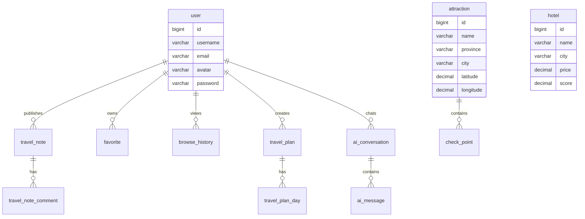

# TravelMind AI 项目架构设计

项目名称：TravelMind AI  
定位：AI 个性化旅游推荐与智能规划平台  
技术路线：Spring Boot 3.3 + Java 21 + Vue 3 + TypeScript + DeepSeek + MySQL 8 + Redis + MinIO

## 1. 总体架构

TravelMind AI 采用前后端分离、模块化单体优先的企业级架构。第一阶段使用单体后端降低交付复杂度，内部按领域模块拆分；当 AI 会话、推荐、社区流量增长后，可平滑拆分为 ai-service、content-service、user-service。

核心链路：

1. 用户输入自然语言需求，例如“我在杭州，预算 3000 元，想去海边玩 3 天”。
2. 前端调用 AI 旅游顾问接口，支持普通响应和 SSE 流式响应。
3. 后端通过 PromptService 构造结构化 Prompt，ConversationService 读取会话上下文。
4. AiService 调用 DeepSeek deepseek-chat。
5. 返回推荐目的地、交通、预算、酒店、景点、打卡点、美食、注意事项、每日行程。
6. 用户可保存为 TravelPlan，收藏景点、酒店或游记。

## 2. 项目目录结构

```text
travelmind-ai/
├── backend/
│   ├── pom.xml
│   ├── Dockerfile
│   ├── src/
│   │   ├── main/
│   │   │   ├── java/com/travelmind/
│   │   │   │   ├── TravelMindApplication.java
│   │   │   │   ├── common/
│   │   │   │   │   ├── api/
│   │   │   │   │   │   ├── Result.java
│   │   │   │   │   │   ├── PageResult.java
│   │   │   │   │   │   └── ErrorCode.java
│   │   │   │   │   ├── exception/
│   │   │   │   │   │   ├── BusinessException.java
│   │   │   │   │   │   └── GlobalExceptionHandler.java
│   │   │   │   │   ├── security/
│   │   │   │   │   │   ├── JwtAuthenticationFilter.java
│   │   │   │   │   │   ├── JwtProperties.java
│   │   │   │   │   │   ├── JwtUtil.java
│   │   │   │   │   │   ├── LoginUser.java
│   │   │   │   │   │   └── SecurityConfig.java
│   │   │   │   │   ├── config/
│   │   │   │   │   │   ├── MybatisPlusConfig.java
│   │   │   │   │   │   ├── RedisConfig.java
│   │   │   │   │   │   ├── MinioConfig.java
│   │   │   │   │   │   ├── Knife4jConfig.java
│   │   │   │   │   │   └── WebMvcConfig.java
│   │   │   │   │   ├── constant/
│   │   │   │   │   │   ├── CacheNames.java
│   │   │   │   │   │   └── SecurityConstants.java
│   │   │   │   │   └── util/
│   │   │   │   │       ├── BeanCopyUtils.java
│   │   │   │   │       └── IpUtils.java
│   │   │   │   ├── module/
│   │   │   │   │   ├── user/
│   │   │   │   │   │   ├── controller/UserController.java
│   │   │   │   │   │   ├── dto/LoginDTO.java
│   │   │   │   │   │   ├── dto/RegisterDTO.java
│   │   │   │   │   │   ├── dto/UserUpdateDTO.java
│   │   │   │   │   │   ├── entity/User.java
│   │   │   │   │   │   ├── mapper/UserMapper.java
│   │   │   │   │   │   ├── mapstruct/UserConvert.java
│   │   │   │   │   │   ├── service/UserService.java
│   │   │   │   │   │   ├── service/impl/UserServiceImpl.java
│   │   │   │   │   │   └── vo/UserVO.java
│   │   │   │   │   ├── attraction/
│   │   │   │   │   │   ├── controller/AttractionController.java
│   │   │   │   │   │   ├── dto/AttractionQueryDTO.java
│   │   │   │   │   │   ├── entity/Attraction.java
│   │   │   │   │   │   ├── mapper/AttractionMapper.java
│   │   │   │   │   │   ├── mapstruct/AttractionConvert.java
│   │   │   │   │   │   ├── service/AttractionService.java
│   │   │   │   │   │   ├── service/impl/AttractionServiceImpl.java
│   │   │   │   │   │   └── vo/AttractionVO.java
│   │   │   │   │   ├── checkpoint/
│   │   │   │   │   │   ├── controller/CheckPointController.java
│   │   │   │   │   │   ├── dto/CheckPointQueryDTO.java
│   │   │   │   │   │   ├── entity/CheckPoint.java
│   │   │   │   │   │   ├── mapper/CheckPointMapper.java
│   │   │   │   │   │   ├── service/CheckPointService.java
│   │   │   │   │   │   └── vo/CheckPointVO.java
│   │   │   │   │   ├── hotel/
│   │   │   │   │   │   ├── controller/HotelController.java
│   │   │   │   │   │   ├── dto/HotelQueryDTO.java
│   │   │   │   │   │   ├── entity/Hotel.java
│   │   │   │   │   │   ├── mapper/HotelMapper.java
│   │   │   │   │   │   ├── service/HotelService.java
│   │   │   │   │   │   └── vo/HotelVO.java
│   │   │   │   │   ├── note/
│   │   │   │   │   │   ├── controller/TravelNoteController.java
│   │   │   │   │   │   ├── dto/TravelNoteCreateDTO.java
│   │   │   │   │   │   ├── dto/TravelNoteCommentDTO.java
│   │   │   │   │   │   ├── entity/TravelNote.java
│   │   │   │   │   │   ├── entity/TravelNoteComment.java
│   │   │   │   │   │   ├── mapper/TravelNoteMapper.java
│   │   │   │   │   │   ├── mapper/TravelNoteCommentMapper.java
│   │   │   │   │   │   ├── service/TravelNoteService.java
│   │   │   │   │   │   └── vo/TravelNoteVO.java
│   │   │   │   │   ├── favorite/
│   │   │   │   │   │   ├── controller/FavoriteController.java
│   │   │   │   │   │   ├── dto/FavoriteDTO.java
│   │   │   │   │   │   ├── entity/Favorite.java
│   │   │   │   │   │   ├── enums/FavoriteType.java
│   │   │   │   │   │   ├── mapper/FavoriteMapper.java
│   │   │   │   │   │   ├── service/FavoriteService.java
│   │   │   │   │   │   └── vo/FavoriteVO.java
│   │   │   │   │   ├── plan/
│   │   │   │   │   │   ├── controller/TravelPlanController.java
│   │   │   │   │   │   ├── dto/TravelPlanCreateDTO.java
│   │   │   │   │   │   ├── dto/TravelPlanUpdateDTO.java
│   │   │   │   │   │   ├── entity/TravelPlan.java
│   │   │   │   │   │   ├── entity/TravelPlanDay.java
│   │   │   │   │   │   ├── mapper/TravelPlanMapper.java
│   │   │   │   │   │   ├── service/TravelPlanService.java
│   │   │   │   │   │   └── vo/TravelPlanVO.java
│   │   │   │   │   ├── ai/
│   │   │   │   │   │   ├── controller/AiController.java
│   │   │   │   │   │   ├── dto/AiChatDTO.java
│   │   │   │   │   │   ├── dto/AiPlanDTO.java
│   │   │   │   │   │   ├── entity/AiConversation.java
│   │   │   │   │   │   ├── entity/AiMessage.java
│   │   │   │   │   │   ├── mapper/AiConversationMapper.java
│   │   │   │   │   │   ├── mapper/AiMessageMapper.java
│   │   │   │   │   │   ├── service/AiService.java
│   │   │   │   │   │   ├── service/PromptService.java
│   │   │   │   │   │   ├── service/ConversationService.java
│   │   │   │   │   │   └── vo/AiTravelPlanVO.java
│   │   │   │   │   └── file/
│   │   │   │   │       ├── controller/FileController.java
│   │   │   │   │       ├── service/FileService.java
│   │   │   │   │       └── vo/FileUploadVO.java
│   │   │   │   └── infrastructure/
│   │   │   │       ├── deepseek/DeepSeekClient.java
│   │   │   │       ├── minio/MinioTemplate.java
│   │   │   │       └── amap/AmapProperties.java
│   │   │   └── resources/
│   │   │       ├── application.yml
│   │   │       ├── application-dev.yml
│   │   │       ├── application-prod.yml
│   │   │       ├── mapper/
│   │   │       │   ├── AttractionMapper.xml
│   │   │       │   ├── HotelMapper.xml
│   │   │       │   └── TravelNoteMapper.xml
│   │   │       └── db/migration/V1__init_schema.sql
│   │   └── test/java/com/travelmind/
│   ├── logs/
│   └── scripts/
├── frontend/
│   ├── package.json
│   ├── vite.config.ts
│   ├── uno.config.ts
│   ├── Dockerfile
│   ├── index.html
│   ├── src/
│   │   ├── main.ts
│   │   ├── App.vue
│   │   ├── assets/
│   │   ├── components/
│   │   │   ├── common/AppHeader.vue
│   │   │   ├── common/LiquidCard.vue
│   │   │   ├── common/ThemeToggle.vue
│   │   │   ├── map/AmapView.vue
│   │   │   └── ai/StreamingAnswer.vue
│   │   ├── layouts/
│   │   │   ├── MainLayout.vue
│   │   │   └── AuthLayout.vue
│   │   ├── router/
│   │   │   ├── index.ts
│   │   │   └── guards.ts
│   │   ├── stores/
│   │   │   ├── user.ts
│   │   │   ├── theme.ts
│   │   │   ├── ai.ts
│   │   │   ├── plan.ts
│   │   │   └── favorite.ts
│   │   ├── api/
│   │   │   ├── http.ts
│   │   │   ├── user.ts
│   │   │   ├── attraction.ts
│   │   │   ├── hotel.ts
│   │   │   ├── note.ts
│   │   │   ├── plan.ts
│   │   │   ├── ai.ts
│   │   │   └── file.ts
│   │   ├── views/
│   │   │   ├── ai/AiAdvisor.vue
│   │   │   ├── ai/AiPlanner.vue
│   │   │   ├── attraction/AttractionList.vue
│   │   │   ├── attraction/AttractionDetail.vue
│   │   │   ├── hotel/HotelList.vue
│   │   │   ├── note/NoteList.vue
│   │   │   ├── note/NoteDetail.vue
│   │   │   ├── plan/PlanList.vue
│   │   │   ├── plan/PlanDetail.vue
│   │   │   ├── user/Login.vue
│   │   │   ├── user/Register.vue
│   │   │   └── user/Profile.vue
│   │   ├── styles/
│   │   │   ├── variables.css
│   │   │   ├── liquid-glass.css
│   │   │   └── transition.css
│   │   ├── types/
│   │   │   ├── api.ts
│   │   │   ├── user.ts
│   │   │   ├── travel.ts
│   │   │   └── ai.ts
│   │   └── utils/
│   │       ├── auth.ts
│   │       ├── amap.ts
│   │       └── sse.ts
├── docs/
│   ├── TravelMind-AI-Architecture.md
│   ├── api/
│   └── deploy/
├── deploy/
│   ├── docker-compose.yml
│   ├── mysql/init.sql
│   ├── nginx/nginx.conf
│   └── minio/
└── README.md
```

## 3. 后端 Maven 依赖

```xml
<properties>
    <java.version>21</java.version>
    <spring-boot.version>3.3.0</spring-boot.version>
    <mybatis-plus.version>3.5.7</mybatis-plus.version>
    <knife4j.version>4.5.0</knife4j.version>
    <jjwt.version>0.12.5</jjwt.version>
    <mapstruct.version>1.5.5.Final</mapstruct.version>
    <minio.version>8.5.10</minio.version>
</properties>

<dependencies>
    <dependency>
        <groupId>org.springframework.boot</groupId>
        <artifactId>spring-boot-starter-web</artifactId>
    </dependency>
    <dependency>
        <groupId>org.springframework.boot</groupId>
        <artifactId>spring-boot-starter-security</artifactId>
    </dependency>
    <dependency>
        <groupId>org.springframework.boot</groupId>
        <artifactId>spring-boot-starter-validation</artifactId>
    </dependency>
    <dependency>
        <groupId>org.springframework.boot</groupId>
        <artifactId>spring-boot-starter-data-redis</artifactId>
    </dependency>
    <dependency>
        <groupId>org.springframework.boot</groupId>
        <artifactId>spring-boot-starter-webflux</artifactId>
    </dependency>
    <dependency>
        <groupId>com.baomidou</groupId>
        <artifactId>mybatis-plus-spring-boot3-starter</artifactId>
        <version>${mybatis-plus.version}</version>
    </dependency>
    <dependency>
        <groupId>com.mysql</groupId>
        <artifactId>mysql-connector-j</artifactId>
        <scope>runtime</scope>
    </dependency>
    <dependency>
        <groupId>io.jsonwebtoken</groupId>
        <artifactId>jjwt-api</artifactId>
        <version>${jjwt.version}</version>
    </dependency>
    <dependency>
        <groupId>io.jsonwebtoken</groupId>
        <artifactId>jjwt-impl</artifactId>
        <version>${jjwt.version}</version>
        <scope>runtime</scope>
    </dependency>
    <dependency>
        <groupId>io.jsonwebtoken</groupId>
        <artifactId>jjwt-jackson</artifactId>
        <version>${jjwt.version}</version>
        <scope>runtime</scope>
    </dependency>
    <dependency>
        <groupId>io.minio</groupId>
        <artifactId>minio</artifactId>
        <version>${minio.version}</version>
    </dependency>
    <dependency>
        <groupId>org.mapstruct</groupId>
        <artifactId>mapstruct</artifactId>
        <version>${mapstruct.version}</version>
    </dependency>
    <dependency>
        <groupId>com.github.xiaoymin</groupId>
        <artifactId>knife4j-openapi3-jakarta-spring-boot-starter</artifactId>
        <version>${knife4j.version}</version>
    </dependency>
    <dependency>
        <groupId>org.projectlombok</groupId>
        <artifactId>lombok</artifactId>
        <optional>true</optional>
    </dependency>
</dependencies>
```

## 4. 数据库设计 SQL

```sql
CREATE DATABASE IF NOT EXISTS travelmind_ai
  DEFAULT CHARACTER SET utf8mb4
  COLLATE utf8mb4_0900_ai_ci;

USE travelmind_ai;

CREATE TABLE user (
  id BIGINT PRIMARY KEY AUTO_INCREMENT COMMENT '主键',
  username VARCHAR(64) NOT NULL COMMENT '用户名',
  email VARCHAR(128) NOT NULL COMMENT '邮箱',
  avatar VARCHAR(512) DEFAULT NULL COMMENT '头像',
  password VARCHAR(255) NOT NULL COMMENT 'BCrypt密码',
  status TINYINT NOT NULL DEFAULT 1 COMMENT '状态 1启用 0禁用',
  create_time DATETIME NOT NULL DEFAULT CURRENT_TIMESTAMP,
  update_time DATETIME NOT NULL DEFAULT CURRENT_TIMESTAMP ON UPDATE CURRENT_TIMESTAMP,
  deleted TINYINT NOT NULL DEFAULT 0,
  UNIQUE KEY uk_user_username (username),
  UNIQUE KEY uk_user_email (email)
) ENGINE=InnoDB COMMENT='用户表';

CREATE TABLE attraction (
  id BIGINT PRIMARY KEY AUTO_INCREMENT,
  name VARCHAR(128) NOT NULL,
  province VARCHAR(64) NOT NULL,
  city VARCHAR(64) NOT NULL,
  description TEXT,
  cover_image VARCHAR(512),
  latitude DECIMAL(10, 7) NOT NULL,
  longitude DECIMAL(10, 7) NOT NULL,
  price DECIMAL(10, 2) DEFAULT 0,
  best_season VARCHAR(64),
  open_time VARCHAR(128),
  score DECIMAL(3, 1) DEFAULT 0,
  tags VARCHAR(255) DEFAULT NULL COMMENT '逗号分隔标签',
  hot_score INT NOT NULL DEFAULT 0,
  create_time DATETIME NOT NULL DEFAULT CURRENT_TIMESTAMP,
  update_time DATETIME NOT NULL DEFAULT CURRENT_TIMESTAMP ON UPDATE CURRENT_TIMESTAMP,
  deleted TINYINT NOT NULL DEFAULT 0,
  KEY idx_attraction_city (city),
  KEY idx_attraction_score (score),
  KEY idx_attraction_hot (hot_score)
) ENGINE=InnoDB COMMENT='景点表';

CREATE TABLE check_point (
  id BIGINT PRIMARY KEY AUTO_INCREMENT,
  attraction_id BIGINT NOT NULL,
  name VARCHAR(128) NOT NULL,
  description TEXT,
  photo VARCHAR(512),
  location VARCHAR(255),
  latitude DECIMAL(10, 7) DEFAULT NULL,
  longitude DECIMAL(10, 7) DEFAULT NULL,
  best_time VARCHAR(64),
  create_time DATETIME NOT NULL DEFAULT CURRENT_TIMESTAMP,
  update_time DATETIME NOT NULL DEFAULT CURRENT_TIMESTAMP ON UPDATE CURRENT_TIMESTAMP,
  deleted TINYINT NOT NULL DEFAULT 0,
  KEY idx_checkpoint_attraction (attraction_id)
) ENGINE=InnoDB COMMENT='打卡点表';

CREATE TABLE hotel (
  id BIGINT PRIMARY KEY AUTO_INCREMENT,
  name VARCHAR(128) NOT NULL,
  city VARCHAR(64) NOT NULL,
  address VARCHAR(255) NOT NULL,
  price DECIMAL(10, 2) NOT NULL,
  score DECIMAL(3, 1) DEFAULT 0,
  cover VARCHAR(512),
  longitude DECIMAL(10, 7) NOT NULL,
  latitude DECIMAL(10, 7) NOT NULL,
  tags VARCHAR(255) DEFAULT NULL,
  create_time DATETIME NOT NULL DEFAULT CURRENT_TIMESTAMP,
  update_time DATETIME NOT NULL DEFAULT CURRENT_TIMESTAMP ON UPDATE CURRENT_TIMESTAMP,
  deleted TINYINT NOT NULL DEFAULT 0,
  KEY idx_hotel_city (city),
  KEY idx_hotel_price (price),
  KEY idx_hotel_score (score)
) ENGINE=InnoDB COMMENT='酒店表';

CREATE TABLE travel_note (
  id BIGINT PRIMARY KEY AUTO_INCREMENT,
  user_id BIGINT NOT NULL,
  title VARCHAR(128) NOT NULL,
  content LONGTEXT NOT NULL,
  cover VARCHAR(512),
  view_count INT NOT NULL DEFAULT 0,
  like_count INT NOT NULL DEFAULT 0,
  collect_count INT NOT NULL DEFAULT 0,
  status TINYINT NOT NULL DEFAULT 1 COMMENT '1发布 0草稿',
  create_time DATETIME NOT NULL DEFAULT CURRENT_TIMESTAMP,
  update_time DATETIME NOT NULL DEFAULT CURRENT_TIMESTAMP ON UPDATE CURRENT_TIMESTAMP,
  deleted TINYINT NOT NULL DEFAULT 0,
  KEY idx_note_user (user_id),
  KEY idx_note_hot (like_count, view_count)
) ENGINE=InnoDB COMMENT='游记表';

CREATE TABLE travel_note_comment (
  id BIGINT PRIMARY KEY AUTO_INCREMENT,
  note_id BIGINT NOT NULL,
  user_id BIGINT NOT NULL,
  parent_id BIGINT DEFAULT NULL,
  content VARCHAR(1000) NOT NULL,
  create_time DATETIME NOT NULL DEFAULT CURRENT_TIMESTAMP,
  deleted TINYINT NOT NULL DEFAULT 0,
  KEY idx_comment_note (note_id),
  KEY idx_comment_user (user_id)
) ENGINE=InnoDB COMMENT='游记评论表';

CREATE TABLE favorite (
  id BIGINT PRIMARY KEY AUTO_INCREMENT,
  user_id BIGINT NOT NULL,
  target_id BIGINT NOT NULL,
  target_type VARCHAR(32) NOT NULL COMMENT 'ATTRACTION/HOTEL/TRAVEL_NOTE',
  create_time DATETIME NOT NULL DEFAULT CURRENT_TIMESTAMP,
  UNIQUE KEY uk_favorite_user_target (user_id, target_id, target_type),
  KEY idx_favorite_user (user_id)
) ENGINE=InnoDB COMMENT='收藏表';

CREATE TABLE browse_history (
  id BIGINT PRIMARY KEY AUTO_INCREMENT,
  user_id BIGINT NOT NULL,
  target_id BIGINT NOT NULL,
  target_type VARCHAR(32) NOT NULL,
  create_time DATETIME NOT NULL DEFAULT CURRENT_TIMESTAMP,
  KEY idx_history_user_time (user_id, create_time)
) ENGINE=InnoDB COMMENT='浏览历史表';

CREATE TABLE travel_plan (
  id BIGINT PRIMARY KEY AUTO_INCREMENT,
  user_id BIGINT NOT NULL,
  title VARCHAR(128) NOT NULL,
  budget DECIMAL(10, 2) NOT NULL,
  days INT NOT NULL,
  destination VARCHAR(128) NOT NULL,
  season VARCHAR(64),
  origin VARCHAR(128),
  preference VARCHAR(255),
  ai_summary TEXT,
  create_time DATETIME NOT NULL DEFAULT CURRENT_TIMESTAMP,
  update_time DATETIME NOT NULL DEFAULT CURRENT_TIMESTAMP ON UPDATE CURRENT_TIMESTAMP,
  deleted TINYINT NOT NULL DEFAULT 0,
  KEY idx_plan_user (user_id)
) ENGINE=InnoDB COMMENT='旅行计划表';

CREATE TABLE travel_plan_day (
  id BIGINT PRIMARY KEY AUTO_INCREMENT,
  plan_id BIGINT NOT NULL,
  day_no INT NOT NULL,
  title VARCHAR(128) NOT NULL,
  itinerary JSON NOT NULL COMMENT '当天行程结构化JSON',
  estimated_cost DECIMAL(10, 2) DEFAULT 0,
  create_time DATETIME NOT NULL DEFAULT CURRENT_TIMESTAMP,
  update_time DATETIME NOT NULL DEFAULT CURRENT_TIMESTAMP ON UPDATE CURRENT_TIMESTAMP,
  UNIQUE KEY uk_plan_day (plan_id, day_no)
) ENGINE=InnoDB COMMENT='旅行计划每日安排';

CREATE TABLE ai_conversation (
  id BIGINT PRIMARY KEY AUTO_INCREMENT,
  user_id BIGINT NOT NULL,
  title VARCHAR(128) NOT NULL,
  scene VARCHAR(32) NOT NULL COMMENT 'ADVISOR/PLAN/BUDGET/HOTEL/ATTRACTION',
  create_time DATETIME NOT NULL DEFAULT CURRENT_TIMESTAMP,
  update_time DATETIME NOT NULL DEFAULT CURRENT_TIMESTAMP ON UPDATE CURRENT_TIMESTAMP,
  deleted TINYINT NOT NULL DEFAULT 0,
  KEY idx_ai_conversation_user (user_id)
) ENGINE=InnoDB COMMENT='AI会话表';

CREATE TABLE ai_message (
  id BIGINT PRIMARY KEY AUTO_INCREMENT,
  conversation_id BIGINT NOT NULL,
  user_id BIGINT NOT NULL,
  role VARCHAR(16) NOT NULL COMMENT 'system/user/assistant',
  content LONGTEXT NOT NULL,
  token_count INT DEFAULT 0,
  create_time DATETIME NOT NULL DEFAULT CURRENT_TIMESTAMP,
  KEY idx_ai_message_conversation (conversation_id, create_time)
) ENGINE=InnoDB COMMENT='AI消息表';
```

## 5. ER 图设计说明



关系说明：

- user 与 travel_note、favorite、browse_history、travel_plan、ai_conversation 均为一对多。
- attraction 与 check_point 为一对多。
- favorite 使用 target_type + target_id 实现多态收藏，避免为景点、酒店、游记分别建收藏表。
- travel_plan 与 travel_plan_day 拆分，便于用户编辑单日行程。
- ai_conversation 与 ai_message 拆分，支持历史会话、上下文记忆、流式响应后落库。

## 6. 实体类设计

通用基类：

```java
@Getter
@Setter
public abstract class BaseEntity {
    @TableId(type = IdType.AUTO)
    private Long id;
    private LocalDateTime createTime;
    private LocalDateTime updateTime;
    @TableLogic
    private Integer deleted;
}
```

User：

```java
@Getter
@Setter
@TableName("user")
public class User extends BaseEntity {
    private String username;
    private String email;
    private String avatar;
    private String password;
    private Integer status;
}
```

Attraction：

```java
@Getter
@Setter
@TableName("attraction")
public class Attraction extends BaseEntity {
    private String name;
    private String province;
    private String city;
    private String description;
    private String coverImage;
    private BigDecimal latitude;
    private BigDecimal longitude;
    private BigDecimal price;
    private String bestSeason;
    private String openTime;
    private BigDecimal score;
    private String tags;
    private Integer hotScore;
}
```

CheckPoint：

```java
@Getter
@Setter
@TableName("check_point")
public class CheckPoint extends BaseEntity {
    private Long attractionId;
    private String name;
    private String description;
    private String photo;
    private String location;
    private BigDecimal latitude;
    private BigDecimal longitude;
    private String bestTime;
}
```

Hotel：

```java
@Getter
@Setter
@TableName("hotel")
public class Hotel extends BaseEntity {
    private String name;
    private String city;
    private String address;
    private BigDecimal price;
    private BigDecimal score;
    private String cover;
    private BigDecimal longitude;
    private BigDecimal latitude;
    private String tags;
}
```

TravelNote：

```java
@Getter
@Setter
@TableName("travel_note")
public class TravelNote extends BaseEntity {
    private Long userId;
    private String title;
    private String content;
    private String cover;
    private Integer viewCount;
    private Integer likeCount;
    private Integer collectCount;
    private Integer status;
}
```

TravelNoteComment：

```java
@Getter
@Setter
@TableName("travel_note_comment")
public class TravelNoteComment {
    @TableId(type = IdType.AUTO)
    private Long id;
    private Long noteId;
    private Long userId;
    private Long parentId;
    private String content;
    private LocalDateTime createTime;
    @TableLogic
    private Integer deleted;
}
```

Favorite：

```java
@Getter
@Setter
@TableName("favorite")
public class Favorite {
    @TableId(type = IdType.AUTO)
    private Long id;
    private Long userId;
    private Long targetId;
    private String targetType;
    private LocalDateTime createTime;
}
```

TravelPlan：

```java
@Getter
@Setter
@TableName("travel_plan")
public class TravelPlan extends BaseEntity {
    private Long userId;
    private String title;
    private BigDecimal budget;
    private Integer days;
    private String destination;
    private String season;
    private String origin;
    private String preference;
    private String aiSummary;
}
```

TravelPlanDay：

```java
@Getter
@Setter
@TableName("travel_plan_day")
public class TravelPlanDay {
    @TableId(type = IdType.AUTO)
    private Long id;
    private Long planId;
    private Integer dayNo;
    private String title;
    private String itinerary;
    private BigDecimal estimatedCost;
    private LocalDateTime createTime;
    private LocalDateTime updateTime;
}
```

AiConversation：

```java
@Getter
@Setter
@TableName("ai_conversation")
public class AiConversation extends BaseEntity {
    private Long userId;
    private String title;
    private String scene;
}
```

AiMessage：

```java
@Getter
@Setter
@TableName("ai_message")
public class AiMessage {
    @TableId(type = IdType.AUTO)
    private Long id;
    private Long conversationId;
    private Long userId;
    private String role;
    private String content;
    private Integer tokenCount;
    private LocalDateTime createTime;
}
```

## 7. DTO 与 VO 设计

DTO：

```java
public record RegisterDTO(
        @NotBlank String username,
        @Email String email,
        @NotBlank @Size(min = 8, max = 32) String password
) {}

public record LoginDTO(
        @NotBlank String account,
        @NotBlank String password
) {}

public record UserUpdateDTO(String username, String avatar) {}

public record AttractionQueryDTO(
        String keyword,
        String province,
        String city,
        String tag,
        Integer pageNo,
        Integer pageSize
) {}

public record CheckPointQueryDTO(Long attractionId) {}

public record HotelQueryDTO(
        String city,
        BigDecimal minPrice,
        BigDecimal maxPrice,
        String sortBy,
        Integer pageNo,
        Integer pageSize
) {}

public record TravelNoteCreateDTO(
        @NotBlank String title,
        @NotBlank String content,
        String cover,
        Integer status
) {}

public record TravelNoteCommentDTO(
        @NotNull Long noteId,
        Long parentId,
        @NotBlank String content
) {}

public record FavoriteDTO(
        @NotNull Long targetId,
        @NotBlank String targetType
) {}

public record TravelPlanCreateDTO(
        @NotBlank String title,
        @NotNull BigDecimal budget,
        @NotNull Integer days,
        @NotBlank String destination,
        String season,
        String origin,
        String preference
) {}

public record TravelPlanUpdateDTO(
        Long id,
        String title,
        BigDecimal budget,
        Integer days,
        String destination,
        String season,
        String preference
) {}

public record AiChatDTO(
        Long conversationId,
        @NotBlank String message,
        String scene
) {}

public record AiPlanDTO(
        @NotBlank String origin,
        @NotBlank String destination,
        @NotNull BigDecimal budget,
        @NotNull Integer days,
        String preference,
        String peopleType
) {}
```

VO：

```java
public record LoginVO(String token, UserVO user) {}

public record UserVO(
        Long id,
        String username,
        String email,
        String avatar,
        LocalDateTime createTime
) {}

public record AttractionVO(
        Long id,
        String name,
        String province,
        String city,
        String description,
        String coverImage,
        BigDecimal latitude,
        BigDecimal longitude,
        BigDecimal price,
        String bestSeason,
        String openTime,
        BigDecimal score,
        List<String> tags
) {}

public record CheckPointVO(
        Long id,
        Long attractionId,
        String name,
        String description,
        String photo,
        String location,
        BigDecimal latitude,
        BigDecimal longitude,
        String bestTime
) {}

public record HotelVO(
        Long id,
        String name,
        String city,
        String address,
        BigDecimal price,
        BigDecimal score,
        String cover,
        BigDecimal longitude,
        BigDecimal latitude,
        List<String> tags
) {}

public record TravelNoteVO(
        Long id,
        Long userId,
        String authorName,
        String authorAvatar,
        String title,
        String content,
        String cover,
        Integer viewCount,
        Integer likeCount,
        Integer collectCount,
        LocalDateTime createTime
) {}

public record FavoriteVO(
        Long id,
        Long targetId,
        String targetType,
        String title,
        String cover,
        LocalDateTime createTime
) {}

public record TravelPlanVO(
        Long id,
        String title,
        BigDecimal budget,
        Integer days,
        String destination,
        String season,
        String origin,
        String preference,
        String aiSummary,
        List<TravelPlanDayVO> daysPlan
) {}

public record TravelPlanDayVO(
        Integer dayNo,
        String title,
        Object itinerary,
        BigDecimal estimatedCost
) {}

public record AiTravelPlanVO(
        String recommendedCity,
        String reason,
        String bestSeason,
        String transport,
        String budgetAnalysis,
        List<String> hotels,
        List<String> attractions,
        List<String> checkPoints,
        List<String> foods,
        List<String> tips,
        List<TravelDayVO> itinerary
) {}

public record TravelDayVO(
        Integer day,
        String theme,
        List<String> morning,
        List<String> afternoon,
        List<String> evening,
        BigDecimal estimatedCost
) {}

public record FileUploadVO(String url, String objectName, String bucket) {}
```

## 8. Mapper 设计

```java
@Mapper
public interface UserMapper extends BaseMapper<User> {}

@Mapper
public interface AttractionMapper extends BaseMapper<Attraction> {
    IPage<Attraction> selectPageByQuery(Page<Attraction> page, @Param("query") AttractionQueryDTO query);
}

@Mapper
public interface CheckPointMapper extends BaseMapper<CheckPoint> {}

@Mapper
public interface HotelMapper extends BaseMapper<Hotel> {
    IPage<Hotel> selectNearby(Page<Hotel> page,
                              @Param("city") String city,
                              @Param("longitude") BigDecimal longitude,
                              @Param("latitude") BigDecimal latitude);
}

@Mapper
public interface TravelNoteMapper extends BaseMapper<TravelNote> {}

@Mapper
public interface TravelNoteCommentMapper extends BaseMapper<TravelNoteComment> {}

@Mapper
public interface FavoriteMapper extends BaseMapper<Favorite> {}

@Mapper
public interface TravelPlanMapper extends BaseMapper<TravelPlan> {}

@Mapper
public interface TravelPlanDayMapper extends BaseMapper<TravelPlanDay> {}

@Mapper
public interface AiConversationMapper extends BaseMapper<AiConversation> {}

@Mapper
public interface AiMessageMapper extends BaseMapper<AiMessage> {}
```

MapStruct：

```java
@Mapper(componentModel = "spring")
public interface UserConvert {
    UserVO toVO(User user);
}

@Mapper(componentModel = "spring")
public interface AttractionConvert {
    AttractionVO toVO(Attraction attraction);
    List<AttractionVO> toVOList(List<Attraction> list);
}
```

## 9. Service 设计

```java
public interface UserService extends IService<User> {
    LoginVO login(LoginDTO dto);
    UserVO register(RegisterDTO dto);
    UserVO currentUser();
    UserVO updateProfile(UserUpdateDTO dto);
    void updateAvatar(String avatar);
}

public interface AttractionService extends IService<Attraction> {
    PageResult<AttractionVO> pageQuery(AttractionQueryDTO dto);
    AttractionVO detail(Long id);
    List<AttractionVO> hot(Integer limit);
}

public interface CheckPointService extends IService<CheckPoint> {
    List<CheckPointVO> listByAttraction(Long attractionId);
}

public interface HotelService extends IService<Hotel> {
    PageResult<HotelVO> pageQuery(HotelQueryDTO dto);
    List<HotelVO> nearby(String city, BigDecimal longitude, BigDecimal latitude);
}

public interface TravelNoteService extends IService<TravelNote> {
    Long publish(TravelNoteCreateDTO dto);
    void like(Long id);
    void comment(TravelNoteCommentDTO dto);
    TravelNoteVO detail(Long id);
    PageResult<TravelNoteVO> hot(Integer pageNo, Integer pageSize);
}

public interface FavoriteService extends IService<Favorite> {
    void add(FavoriteDTO dto);
    void cancel(FavoriteDTO dto);
    PageResult<FavoriteVO> page(String targetType, Integer pageNo, Integer pageSize);
}

public interface TravelPlanService extends IService<TravelPlan> {
    Long create(TravelPlanCreateDTO dto);
    void updatePlan(TravelPlanUpdateDTO dto);
    void deletePlan(Long id);
    TravelPlanVO detail(Long id);
    TravelPlanVO generateRoute(Long id);
}

public interface AiService {
    String chat(AiChatDTO dto);
    Flux<ServerSentEvent<String>> streamChat(AiChatDTO dto);
    AiTravelPlanVO generatePlan(AiPlanDTO dto);
    String analyzeBudget(AiPlanDTO dto);
    String recommendHotel(AiPlanDTO dto);
    String recommendAttraction(AiPlanDTO dto);
}

public interface PromptService {
    String buildAdvisorPrompt(AiChatDTO dto, List<AiMessage> context);
    String buildPlanPrompt(AiPlanDTO dto);
    String buildBudgetPrompt(AiPlanDTO dto);
    String buildHotelPrompt(AiPlanDTO dto);
    String buildAttractionPrompt(AiPlanDTO dto);
}

public interface ConversationService {
    AiConversation getOrCreate(Long userId, Long conversationId, String scene, String title);
    List<AiMessage> recentMessages(Long conversationId, int limit);
    void saveUserMessage(Long conversationId, Long userId, String content);
    void saveAssistantMessage(Long conversationId, Long userId, String content);
}
```

## 10. Controller 设计

```java
@RestController
@RequestMapping("/api/auth")
@RequiredArgsConstructor
@Tag(name = "认证")
public class AuthController {
    private final UserService userService;

    @PostMapping("/register")
    public Result<UserVO> register(@Valid @RequestBody RegisterDTO dto) {
        return Result.ok(userService.register(dto));
    }

    @PostMapping("/login")
    public Result<LoginVO> login(@Valid @RequestBody LoginDTO dto) {
        return Result.ok(userService.login(dto));
    }
}
```

```java
@RestController
@RequestMapping("/api/users")
@RequiredArgsConstructor
@Tag(name = "用户")
public class UserController {
    private final UserService userService;

    @GetMapping("/me")
    public Result<UserVO> me() {
        return Result.ok(userService.currentUser());
    }

    @PutMapping("/me")
    public Result<UserVO> update(@Valid @RequestBody UserUpdateDTO dto) {
        return Result.ok(userService.updateProfile(dto));
    }
}
```

```java
@RestController
@RequestMapping("/api/attractions")
@RequiredArgsConstructor
@Tag(name = "景点")
public class AttractionController {
    private final AttractionService attractionService;

    @GetMapping
    public Result<PageResult<AttractionVO>> page(AttractionQueryDTO dto) {
        return Result.ok(attractionService.pageQuery(dto));
    }

    @GetMapping("/{id}")
    public Result<AttractionVO> detail(@PathVariable Long id) {
        return Result.ok(attractionService.detail(id));
    }

    @GetMapping("/hot")
    public Result<List<AttractionVO>> hot(@RequestParam(defaultValue = "10") Integer limit) {
        return Result.ok(attractionService.hot(limit));
    }
}
```

```java
@RestController
@RequestMapping("/api/check-points")
@RequiredArgsConstructor
@Tag(name = "打卡点")
public class CheckPointController {
    private final CheckPointService checkPointService;

    @GetMapping
    public Result<List<CheckPointVO>> list(@RequestParam Long attractionId) {
        return Result.ok(checkPointService.listByAttraction(attractionId));
    }
}
```

```java
@RestController
@RequestMapping("/api/hotels")
@RequiredArgsConstructor
@Tag(name = "酒店")
public class HotelController {
    private final HotelService hotelService;

    @GetMapping
    public Result<PageResult<HotelVO>> page(HotelQueryDTO dto) {
        return Result.ok(hotelService.pageQuery(dto));
    }

    @GetMapping("/nearby")
    public Result<List<HotelVO>> nearby(String city, BigDecimal longitude, BigDecimal latitude) {
        return Result.ok(hotelService.nearby(city, longitude, latitude));
    }
}
```

```java
@RestController
@RequestMapping("/api/notes")
@RequiredArgsConstructor
@Tag(name = "游记社区")
public class TravelNoteController {
    private final TravelNoteService travelNoteService;

    @PostMapping
    public Result<Long> publish(@Valid @RequestBody TravelNoteCreateDTO dto) {
        return Result.ok(travelNoteService.publish(dto));
    }

    @PostMapping("/{id}/like")
    public Result<Void> like(@PathVariable Long id) {
        travelNoteService.like(id);
        return Result.ok();
    }

    @PostMapping("/comments")
    public Result<Void> comment(@Valid @RequestBody TravelNoteCommentDTO dto) {
        travelNoteService.comment(dto);
        return Result.ok();
    }

    @GetMapping("/hot")
    public Result<PageResult<TravelNoteVO>> hot(Integer pageNo, Integer pageSize) {
        return Result.ok(travelNoteService.hot(pageNo, pageSize));
    }
}
```

```java
@RestController
@RequestMapping("/api/favorites")
@RequiredArgsConstructor
@Tag(name = "收藏")
public class FavoriteController {
    private final FavoriteService favoriteService;

    @PostMapping
    public Result<Void> add(@Valid @RequestBody FavoriteDTO dto) {
        favoriteService.add(dto);
        return Result.ok();
    }

    @DeleteMapping
    public Result<Void> cancel(@Valid @RequestBody FavoriteDTO dto) {
        favoriteService.cancel(dto);
        return Result.ok();
    }

    @GetMapping
    public Result<PageResult<FavoriteVO>> page(String targetType, Integer pageNo, Integer pageSize) {
        return Result.ok(favoriteService.page(targetType, pageNo, pageSize));
    }
}
```

```java
@RestController
@RequestMapping("/api/plans")
@RequiredArgsConstructor
@Tag(name = "行程规划")
public class TravelPlanController {
    private final TravelPlanService travelPlanService;

    @PostMapping
    public Result<Long> create(@Valid @RequestBody TravelPlanCreateDTO dto) {
        return Result.ok(travelPlanService.create(dto));
    }

    @PutMapping
    public Result<Void> update(@Valid @RequestBody TravelPlanUpdateDTO dto) {
        travelPlanService.updatePlan(dto);
        return Result.ok();
    }

    @DeleteMapping("/{id}")
    public Result<Void> delete(@PathVariable Long id) {
        travelPlanService.deletePlan(id);
        return Result.ok();
    }

    @PostMapping("/{id}/route")
    public Result<TravelPlanVO> generateRoute(@PathVariable Long id) {
        return Result.ok(travelPlanService.generateRoute(id));
    }
}
```

```java
@RestController
@RequestMapping("/api/ai")
@RequiredArgsConstructor
@Tag(name = "AI旅游")
public class AiController {
    private final AiService aiService;

    @PostMapping("/advisor")
    public Result<String> advisor(@Valid @RequestBody AiChatDTO dto) {
        return Result.ok(aiService.chat(dto));
    }

    @PostMapping(value = "/advisor/stream", produces = MediaType.TEXT_EVENT_STREAM_VALUE)
    public Flux<ServerSentEvent<String>> advisorStream(@Valid @RequestBody AiChatDTO dto) {
        return aiService.streamChat(dto);
    }

    @PostMapping("/plan")
    public Result<AiTravelPlanVO> plan(@Valid @RequestBody AiPlanDTO dto) {
        return Result.ok(aiService.generatePlan(dto));
    }

    @PostMapping("/budget")
    public Result<String> budget(@Valid @RequestBody AiPlanDTO dto) {
        return Result.ok(aiService.analyzeBudget(dto));
    }
}
```

## 11. 统一返回对象与异常处理

```java
@Getter
@Setter
@NoArgsConstructor
@AllArgsConstructor
public class Result<T> {
    private Integer code;
    private String message;
    private T data;
    private Long timestamp;

    public static <T> Result<T> ok(T data) {
        return new Result<>(0, "success", data, System.currentTimeMillis());
    }

    public static Result<Void> ok() {
        return new Result<>(0, "success", null, System.currentTimeMillis());
    }

    public static <T> Result<T> fail(Integer code, String message) {
        return new Result<>(code, message, null, System.currentTimeMillis());
    }
}
```

```java
public enum ErrorCode {
    SUCCESS(0, "success"),
    PARAM_ERROR(40000, "参数错误"),
    UNAUTHORIZED(40100, "未认证"),
    FORBIDDEN(40300, "无权限"),
    NOT_FOUND(40400, "资源不存在"),
    USER_EXISTS(40901, "用户已存在"),
    LOGIN_FAILED(40101, "账号或密码错误"),
    AI_ERROR(50010, "AI服务异常"),
    SYSTEM_ERROR(50000, "系统异常");

    private final Integer code;
    private final String message;
}
```

```java
@Getter
public class BusinessException extends RuntimeException {
    private final Integer code;

    public BusinessException(ErrorCode errorCode) {
        super(errorCode.getMessage());
        this.code = errorCode.getCode();
    }

    public BusinessException(ErrorCode errorCode, String message) {
        super(message);
        this.code = errorCode.getCode();
    }
}
```

```java
@RestControllerAdvice
@Slf4j
public class GlobalExceptionHandler {
    @ExceptionHandler(BusinessException.class)
    public Result<Void> handleBusiness(BusinessException ex) {
        return Result.fail(ex.getCode(), ex.getMessage());
    }

    @ExceptionHandler(MethodArgumentNotValidException.class)
    public Result<Void> handleValid(MethodArgumentNotValidException ex) {
        String message = ex.getBindingResult().getFieldErrors().stream()
                .map(FieldError::getDefaultMessage)
                .findFirst()
                .orElse("参数错误");
        return Result.fail(ErrorCode.PARAM_ERROR.getCode(), message);
    }

    @ExceptionHandler(Exception.class)
    public Result<Void> handleException(Exception ex) {
        log.error("系统异常", ex);
        return Result.fail(ErrorCode.SYSTEM_ERROR.getCode(), ErrorCode.SYSTEM_ERROR.getMessage());
    }
}
```

## 12. JWT 与 Spring Security

JWT 载荷只存 userId、username、issuedAt、expiration。敏感资料不进入 token。Redis 保存登录态和黑名单，支持退出登录与 token 续期。

```java
@ConfigurationProperties(prefix = "travelmind.jwt")
public record JwtProperties(
        String secret,
        Long expireSeconds,
        String issuer
) {}
```

```java
@Component
@RequiredArgsConstructor
public class JwtUtil {
    private final JwtProperties properties;

    public String generateToken(Long userId, String username) {
        Date now = new Date();
        Date expireAt = new Date(now.getTime() + properties.expireSeconds() * 1000);
        SecretKey key = Keys.hmacShaKeyFor(properties.secret().getBytes(StandardCharsets.UTF_8));
        return Jwts.builder()
                .issuer(properties.issuer())
                .subject(String.valueOf(userId))
                .claim("username", username)
                .issuedAt(now)
                .expiration(expireAt)
                .signWith(key)
                .compact();
    }

    public Claims parse(String token) {
        SecretKey key = Keys.hmacShaKeyFor(properties.secret().getBytes(StandardCharsets.UTF_8));
        return Jwts.parser().verifyWith(key).build()
                .parseSignedClaims(token)
                .getPayload();
    }
}
```

```java
@Configuration
@EnableWebSecurity
@RequiredArgsConstructor
public class SecurityConfig {
    private final JwtAuthenticationFilter jwtAuthenticationFilter;

    @Bean
    public SecurityFilterChain filterChain(HttpSecurity http) throws Exception {
        return http
                .csrf(AbstractHttpConfigurer::disable)
                .sessionManagement(config -> config.sessionCreationPolicy(SessionCreationPolicy.STATELESS))
                .authorizeHttpRequests(auth -> auth
                        .requestMatchers(
                                "/api/auth/**",
                                "/doc.html",
                                "/webjars/**",
                                "/v3/api-docs/**"
                        ).permitAll()
                        .requestMatchers(HttpMethod.GET, "/api/attractions/**", "/api/hotels/**", "/api/notes/**").permitAll()
                        .anyRequest().authenticated())
                .addFilterBefore(jwtAuthenticationFilter, UsernamePasswordAuthenticationFilter.class)
                .build();
    }

    @Bean
    public PasswordEncoder passwordEncoder() {
        return new BCryptPasswordEncoder();
    }
}
```

## 13. Redis 缓存设计

命名规范：`travelmind:{module}:{business}:{id}`。

| Key | 类型 | TTL | 说明 |
| --- | --- | --- | --- |
| `travelmind:login:token:{userId}` | String | JWT 剩余时间 | 用户当前 token |
| `travelmind:jwt:blacklist:{jti}` | String | JWT 剩余时间 | 退出登录黑名单 |
| `travelmind:attraction:hot` | List/JSON | 30 min | 热门景点 |
| `travelmind:attraction:detail:{id}` | JSON | 60 min | 景点详情 |
| `travelmind:hotel:city:{city}` | JSON | 30 min | 城市酒店列表 |
| `travelmind:note:hot` | JSON | 10 min | 热门游记 |
| `travelmind:ai:context:{conversationId}` | List | 24 h | 最近上下文 |
| `travelmind:rate:ai:{userId}` | Counter | 1 min | AI 限流 |

缓存策略：

- 景点、酒店详情：Cache Aside，更新时删除缓存。
- 热门榜单：定时刷新 + 查询兜底。
- AI 上下文：Redis 保存最近 10 条，MySQL 保存完整历史。
- 点赞、浏览量：Redis 计数，定时批量落库。

## 14. AI 模块实现

配置：

```yaml
travelmind:
  ai:
    deepseek:
      base-url: https://api.deepseek.com
      api-key: ${DEEPSEEK_API_KEY}
      model: deepseek-chat
      temperature: 0.7
      max-tokens: 4096
```

DeepSeekClient：

```java
@Component
@RequiredArgsConstructor
public class DeepSeekClient {
    private final WebClient deepSeekWebClient;
    private final DeepSeekProperties properties;

    public Mono<String> chat(List<AiMessageParam> messages) {
        Map<String, Object> body = Map.of(
                "model", properties.model(),
                "messages", messages,
                "temperature", properties.temperature(),
                "stream", false
        );
        return deepSeekWebClient.post()
                .uri("/chat/completions")
                .bodyValue(body)
                .retrieve()
                .bodyToMono(DeepSeekResponse.class)
                .map(response -> response.choices().getFirst().message().content());
    }

    public Flux<String> stream(List<AiMessageParam> messages) {
        Map<String, Object> body = Map.of(
                "model", properties.model(),
                "messages", messages,
                "temperature", properties.temperature(),
                "stream", true
        );
        return deepSeekWebClient.post()
                .uri("/chat/completions")
                .bodyValue(body)
                .retrieve()
                .bodyToFlux(String.class);
    }
}
```

PromptService 核心 Prompt：

```java
@Service
public class PromptServiceImpl implements PromptService {
    @Override
    public String buildAdvisorPrompt(AiChatDTO dto, List<AiMessage> context) {
        return """
                你是 TravelMind AI 旅游顾问，请用专业、克制、可信的方式回答。
                必须基于用户所在地、预算、天数、偏好生成建议。
                返回内容必须包含：
                1. 推荐旅游目的地
                2. 推荐原因
                3. 最佳旅游时间
                4. 推荐出行方式
                5. 预计费用
                6. 酒店推荐
                7. 美食推荐
                8. 网红打卡点
                9. 每日行程规划
                10. 注意事项
                如果预算明显不足，需要给出压缩方案。
                用户输入：%s
                """.formatted(dto.message());
    }

    @Override
    public String buildPlanPrompt(AiPlanDTO dto) {
        return """
                请为用户生成结构化旅行计划。
                出发地：%s
                目的地：%s
                预算：%s 元
                天数：%s 天
                偏好：%s
                人群：%s
                输出 JSON，字段包括 recommendedCity、reason、bestSeason、transport、
                budgetAnalysis、hotels、attractions、checkPoints、foods、tips、itinerary。
                itinerary 每天包含 day、theme、morning、afternoon、evening、estimatedCost。
                """.formatted(dto.origin(), dto.destination(), dto.budget(), dto.days(), dto.preference(), dto.peopleType());
    }
}
```

AiService 流式响应：

```java
@Service
@RequiredArgsConstructor
public class AiServiceImpl implements AiService {
    private final DeepSeekClient deepSeekClient;
    private final PromptService promptService;
    private final ConversationService conversationService;
    private final ObjectMapper objectMapper;

    @Override
    public String chat(AiChatDTO dto) {
        Long userId = SecurityUtils.getUserId();
        AiConversation conversation = conversationService.getOrCreate(
                userId, dto.conversationId(), dto.scene(), "AI旅游顾问");
        conversationService.saveUserMessage(conversation.getId(), userId, dto.message());
        List<AiMessage> context = conversationService.recentMessages(conversation.getId(), 10);
        String prompt = promptService.buildAdvisorPrompt(dto, context);
        String answer = deepSeekClient.chat(List.of(
                new AiMessageParam("system", "你是 TravelMind AI，一名专业旅行规划师。"),
                new AiMessageParam("user", prompt)
        )).block();
        conversationService.saveAssistantMessage(conversation.getId(), userId, answer);
        return answer;
    }

    @Override
    public Flux<ServerSentEvent<String>> streamChat(AiChatDTO dto) {
        String prompt = promptService.buildAdvisorPrompt(dto, List.of());
        return deepSeekClient.stream(List.of(
                        new AiMessageParam("system", "你是 TravelMind AI，一名专业旅行规划师。"),
                        new AiMessageParam("user", prompt)
                ))
                .map(chunk -> ServerSentEvent.builder(chunk).event("message").build())
                .onErrorResume(ex -> Flux.just(ServerSentEvent.builder("AI服务暂时不可用").event("error").build()));
    }

    @Override
    public AiTravelPlanVO generatePlan(AiPlanDTO dto) {
        String prompt = promptService.buildPlanPrompt(dto);
        String json = deepSeekClient.chat(List.of(new AiMessageParam("user", prompt))).block();
        try {
            return objectMapper.readValue(json, AiTravelPlanVO.class);
        } catch (JsonProcessingException ex) {
            throw new BusinessException(ErrorCode.AI_ERROR, "AI返回格式解析失败");
        }
    }
}
```

免费方案说明：

- 使用 DeepSeek 官方 API，不引入付费商业 SDK。
- AI Key 从环境变量读取，不进入代码仓库。
- 对 AI 接口增加用户级限流，避免被刷爆额度。
- 历史会话保存在 MySQL，近期上下文保存在 Redis。
- 后续可增加 Ollama 本地模型作为备用 Provider。

## 15. 高德地图 JS SDK 集成方案

前端环境变量：

```env
VITE_AMAP_KEY=你的高德Web端Key
VITE_AMAP_SECURITY_CODE=你的安全密钥
```

`src/utils/amap.ts`：

```ts
import AMapLoader from '@amap/amap-jsapi-loader'

export async function loadAmap() {
  ;(window as any)._AMapSecurityConfig = {
    securityJsCode: import.meta.env.VITE_AMAP_SECURITY_CODE,
  }

  return AMapLoader.load({
    key: import.meta.env.VITE_AMAP_KEY,
    version: '2.0',
    plugins: ['AMap.Scale', 'AMap.ToolBar', 'AMap.Geolocation', 'AMap.Driving'],
  })
}
```

`AmapView.vue`：

```vue
<template>
  <div ref="mapRef" class="amap-view"></div>
</template>

<script setup lang="ts">
import { onMounted, ref } from 'vue'
import { loadAmap } from '@/utils/amap'

const props = defineProps<{
  longitude: number
  latitude: number
  markers?: Array<{ longitude: number; latitude: number; title: string }>
}>()

const mapRef = ref<HTMLDivElement>()

onMounted(async () => {
  const AMap = await loadAmap()
  const map = new AMap.Map(mapRef.value, {
    zoom: 13,
    center: [props.longitude, props.latitude],
    viewMode: '2D',
  })
  map.addControl(new AMap.Scale())
  map.addControl(new AMap.ToolBar())
  props.markers?.forEach(item => {
    new AMap.Marker({
      map,
      position: [item.longitude, item.latitude],
      title: item.title,
    })
  })
})
</script>

<style scoped>
.amap-view {
  width: 100%;
  height: 360px;
  border-radius: 24px;
  overflow: hidden;
}
</style>
```

## 16. 文件上传方案

MinIO 用于头像、景点封面、酒店封面、游记图片、打卡点照片。

```java
@RestController
@RequestMapping("/api/files")
@RequiredArgsConstructor
public class FileController {
    private final FileService fileService;

    @PostMapping("/upload")
    public Result<FileUploadVO> upload(@RequestPart MultipartFile file,
                                       @RequestParam(defaultValue = "travelmind") String bucket) {
        return Result.ok(fileService.upload(file, bucket));
    }
}
```

```java
@Service
@RequiredArgsConstructor
public class FileServiceImpl implements FileService {
    private final MinioClient minioClient;
    private final MinioProperties properties;

    @Override
    public FileUploadVO upload(MultipartFile file, String bucket) {
        String ext = StringUtils.getFilenameExtension(file.getOriginalFilename());
        String objectName = LocalDate.now() + "/" + UUID.randomUUID() + "." + ext;
        try (InputStream input = file.getInputStream()) {
            minioClient.putObject(PutObjectArgs.builder()
                    .bucket(bucket)
                    .object(objectName)
                    .contentType(file.getContentType())
                    .stream(input, file.getSize(), -1)
                    .build());
            String url = properties.publicEndpoint() + "/" + bucket + "/" + objectName;
            return new FileUploadVO(url, objectName, bucket);
        } catch (Exception ex) {
            throw new BusinessException(ErrorCode.SYSTEM_ERROR, "文件上传失败");
        }
    }
}
```

上传限制：

- 单图最大 10MB。
- 仅允许 jpg、jpeg、png、webp。
- 后端校验 MIME 与后缀。
- 生产环境通过 Nginx 代理 MinIO 公共读地址。

## 17. 接口文档设计

Knife4j 地址：

- 开发环境：`http://localhost:8080/doc.html`
- OpenAPI JSON：`http://localhost:8080/v3/api-docs`

接口分组：

| 分组 | 前缀 | 说明 |
| --- | --- | --- |
| 认证 | `/api/auth` | 注册、登录 |
| 用户 | `/api/users` | 个人中心、头像、历史 |
| 景点 | `/api/attractions` | 列表、详情、热门 |
| 打卡点 | `/api/check-points` | 景点下打卡点 |
| 酒店 | `/api/hotels` | 酒店列表、附近酒店 |
| 游记 | `/api/notes` | 发布、点赞、评论、热门 |
| 收藏 | `/api/favorites` | 收藏和取消收藏 |
| 行程 | `/api/plans` | 创建、编辑、删除、生成路线 |
| AI | `/api/ai` | 顾问、规划、预算、酒店、景点推荐 |
| 文件 | `/api/files` | 上传 |

RESTful 约定：

- 查询使用 GET。
- 创建使用 POST。
- 全量或主要字段更新使用 PUT。
- 删除使用 DELETE。
- 统一返回 `Result<T>`。
- 分页统一返回 `PageResult<T>`。

## 18. 前端路由设计

```ts
import { createRouter, createWebHistory } from 'vue-router'

export const router = createRouter({
  history: createWebHistory(),
  routes: [
    { path: '/login', component: () => import('@/views/user/Login.vue'), meta: { public: true } },
    { path: '/register', component: () => import('@/views/user/Register.vue'), meta: { public: true } },
    {
      path: '/',
      component: () => import('@/layouts/MainLayout.vue'),
      children: [
        { path: '', redirect: '/ai/advisor' },
        { path: 'ai/advisor', component: () => import('@/views/ai/AiAdvisor.vue') },
        { path: 'ai/planner', component: () => import('@/views/ai/AiPlanner.vue') },
        { path: 'attractions', component: () => import('@/views/attraction/AttractionList.vue') },
        { path: 'attractions/:id', component: () => import('@/views/attraction/AttractionDetail.vue') },
        { path: 'hotels', component: () => import('@/views/hotel/HotelList.vue') },
        { path: 'notes', component: () => import('@/views/note/NoteList.vue') },
        { path: 'notes/:id', component: () => import('@/views/note/NoteDetail.vue') },
        { path: 'plans', component: () => import('@/views/plan/PlanList.vue'), meta: { auth: true } },
        { path: 'plans/:id', component: () => import('@/views/plan/PlanDetail.vue'), meta: { auth: true } },
        { path: 'profile', component: () => import('@/views/user/Profile.vue'), meta: { auth: true } },
      ],
    },
  ],
})
```

## 19. Pinia 设计

```ts
export const useUserStore = defineStore('user', {
  state: () => ({
    token: localStorage.getItem('token') || '',
    user: null as UserVO | null,
  }),
  getters: {
    isLogin: state => Boolean(state.token),
  },
  actions: {
    async login(payload: LoginDTO) {
      const res = await loginApi(payload)
      this.token = res.token
      this.user = res.user
      localStorage.setItem('token', res.token)
    },
    logout() {
      this.token = ''
      this.user = null
      localStorage.removeItem('token')
    },
  },
})
```

```ts
export const useAiStore = defineStore('ai', {
  state: () => ({
    conversationId: undefined as number | undefined,
    streaming: false,
    answer: '',
  }),
  actions: {
    async ask(message: string) {
      this.streaming = true
      this.answer = ''
      await streamAiAdvisor({
        conversationId: this.conversationId,
        message,
        scene: 'ADVISOR',
      }, chunk => {
        this.answer += chunk
      })
      this.streaming = false
    },
  },
})
```

```ts
export const useThemeStore = defineStore('theme', {
  state: () => ({
    dark: window.matchMedia('(prefers-color-scheme: dark)').matches,
  }),
  actions: {
    toggle() {
      this.dark = !this.dark
      document.documentElement.classList.toggle('dark', this.dark)
    },
  },
})
```

## 20. Axios 封装

```ts
import axios from 'axios'
import { useUserStore } from '@/stores/user'

export interface ApiResult<T> {
  code: number
  message: string
  data: T
  timestamp: number
}

export const http = axios.create({
  baseURL: import.meta.env.VITE_API_BASE_URL,
  timeout: 20000,
})

http.interceptors.request.use(config => {
  const userStore = useUserStore()
  if (userStore.token) {
    config.headers.Authorization = `Bearer ${userStore.token}`
  }
  return config
})

http.interceptors.response.use(
  response => {
    const result = response.data as ApiResult<unknown>
    if (result.code !== 0) {
      window.$message?.error(result.message)
      return Promise.reject(result)
    }
    return result.data
  },
  error => {
    window.$message?.error(error.response?.data?.message || '网络异常')
    return Promise.reject(error)
  },
)
```

SSE 封装：

```ts
export async function streamAiAdvisor(
  payload: AiChatDTO,
  onMessage: (chunk: string) => void,
) {
  const token = localStorage.getItem('token')
  const response = await fetch(`${import.meta.env.VITE_API_BASE_URL}/api/ai/advisor/stream`, {
    method: 'POST',
    headers: {
      'Content-Type': 'application/json',
      Authorization: token ? `Bearer ${token}` : '',
    },
    body: JSON.stringify(payload),
  })

  const reader = response.body?.getReader()
  const decoder = new TextDecoder('utf-8')
  while (reader) {
    const { done, value } = await reader.read()
    if (done) break
    onMessage(decoder.decode(value, { stream: true }))
  }
}
```

## 21. iOS 18 / Liquid Glass UI 规范

设计关键词：

- 毛玻璃：`backdrop-filter: blur(28px) saturate(180%)`
- Liquid Glass：半透明卡片、环境色反射、柔和边框、动态阴影
- 圆角：页面主卡片 24px，控件 14px，图片 20px
- 动画：200ms 到 320ms，使用 cubic-bezier
- 深色模式：背景接近系统黑，卡片使用透明白
- 浅色模式：背景使用冷白和淡蓝灰，不做大面积单色渐变

```css
:root {
  --tm-bg: #f5f7fb;
  --tm-text: #111827;
  --tm-muted: #667085;
  --tm-glass-bg: rgba(255, 255, 255, 0.62);
  --tm-glass-border: rgba(255, 255, 255, 0.72);
  --tm-shadow: 0 18px 48px rgba(20, 35, 70, 0.14);
  --tm-radius-lg: 24px;
}

.dark {
  --tm-bg: #0b0d12;
  --tm-text: #f8fafc;
  --tm-muted: #98a2b3;
  --tm-glass-bg: rgba(28, 32, 42, 0.58);
  --tm-glass-border: rgba(255, 255, 255, 0.12);
  --tm-shadow: 0 22px 58px rgba(0, 0, 0, 0.38);
}

.liquid-card {
  border: 1px solid var(--tm-glass-border);
  border-radius: var(--tm-radius-lg);
  background: var(--tm-glass-bg);
  box-shadow: var(--tm-shadow);
  backdrop-filter: blur(28px) saturate(180%);
  transition: transform 240ms cubic-bezier(.2,.8,.2,1), box-shadow 240ms;
}

.liquid-card:hover {
  transform: translateY(-2px);
}
```

Naive UI 主题：

```ts
import { darkTheme, lightTheme } from 'naive-ui'

export const naiveThemeOverrides = {
  common: {
    borderRadius: '14px',
    primaryColor: '#007aff',
    primaryColorHover: '#2997ff',
  },
}
```

## 22. 关键页面规划

AI 旅游顾问页：

- 顶部为输入区，支持自然语言输入。
- 下方为流式回答区域。
- 右侧或移动端下方展示预算分布 ECharts、推荐地图、可保存计划按钮。

景点详情页：

- 顶部真实封面图。
- 基础信息、评分、门票、开放时间。
- 高德地图定位。
- 打卡点横向滑动卡片。
- 附近酒店推荐。

行程详情页：

- Day 时间线。
- 每天上午、下午、晚上三个区块。
- 地图路线预览。
- 预算拆分图。

社区游记页：

- 瀑布流卡片。
- 热门排序。
- 点赞、收藏、评论。

## 23. ECharts 预算分析

```ts
export const budgetOption = (data: Array<{ name: string; value: number }>) => ({
  tooltip: { trigger: 'item' },
  series: [{
    type: 'pie',
    radius: ['48%', '72%'],
    avoidLabelOverlap: true,
    itemStyle: { borderRadius: 8 },
    data,
  }],
})
```

## 24. Docker 部署

`docker-compose.yml`：

```yaml
version: "3.9"

services:
  mysql:
    image: mysql:8.0
    container_name: travelmind-mysql
    environment:
      MYSQL_ROOT_PASSWORD: root
      MYSQL_DATABASE: travelmind_ai
    ports:
      - "3306:3306"
    volumes:
      - ./mysql/data:/var/lib/mysql
      - ./mysql/init.sql:/docker-entrypoint-initdb.d/init.sql

  redis:
    image: redis:7.2
    container_name: travelmind-redis
    ports:
      - "6379:6379"
    command: redis-server --appendonly yes
    volumes:
      - ./redis/data:/data

  minio:
    image: minio/minio
    container_name: travelmind-minio
    environment:
      MINIO_ROOT_USER: minioadmin
      MINIO_ROOT_PASSWORD: minioadmin
    command: server /data --console-address ":9001"
    ports:
      - "9000:9000"
      - "9001:9001"
    volumes:
      - ./minio/data:/data

  backend:
    build: ../backend
    container_name: travelmind-backend
    depends_on:
      - mysql
      - redis
      - minio
    environment:
      SPRING_PROFILES_ACTIVE: prod
      DEEPSEEK_API_KEY: ${DEEPSEEK_API_KEY}
    ports:
      - "8080:8080"

  frontend:
    build: ../frontend
    container_name: travelmind-frontend
    depends_on:
      - backend
    ports:
      - "80:80"
```

Nginx：

```nginx
server {
    listen 80;
    server_name _;

    root /usr/share/nginx/html;
    index index.html;

    location / {
        try_files $uri $uri/ /index.html;
    }

    location /api/ {
        proxy_pass http://backend:8080/api/;
        proxy_set_header Host $host;
        proxy_set_header X-Real-IP $remote_addr;
        proxy_set_header X-Forwarded-For $proxy_add_x_forwarded_for;
    }

    location /minio/ {
        proxy_pass http://minio:9000/;
    }
}
```

## 25. application.yml

```yaml
server:
  port: 8080

spring:
  application:
    name: travelmind-ai
  datasource:
    driver-class-name: com.mysql.cj.jdbc.Driver
    url: jdbc:mysql://localhost:3306/travelmind_ai?useUnicode=true&characterEncoding=utf8mb4&serverTimezone=Asia/Shanghai
    username: root
    password: root
  data:
    redis:
      host: localhost
      port: 6379
  servlet:
    multipart:
      max-file-size: 10MB
      max-request-size: 20MB

mybatis-plus:
  mapper-locations: classpath:/mapper/**/*.xml
  configuration:
    map-underscore-to-camel-case: true
  global-config:
    db-config:
      logic-delete-field: deleted
      logic-delete-value: 1
      logic-not-delete-value: 0

knife4j:
  enable: true

travelmind:
  jwt:
    secret: ${JWT_SECRET:travelmind-ai-secret-key-must-be-32bytes}
    expire-seconds: 604800
    issuer: travelmind-ai
  minio:
    endpoint: http://localhost:9000
    public-endpoint: http://localhost:9000
    access-key: minioadmin
    secret-key: minioadmin
  ai:
    deepseek:
      base-url: https://api.deepseek.com
      api-key: ${DEEPSEEK_API_KEY}
      model: deepseek-chat
      temperature: 0.7
```

## 26. 开发规范

后端：

- 包名小写，类名大驼峰，方法名小驼峰。
- Controller 不写业务逻辑，只做参数校验与服务编排。
- Service 接口和实现分离。
- DTO 入参校验使用 Jakarta Validation。
- VO 不返回密码、内部状态、逻辑删除字段。
- 金额使用 BigDecimal。
- 时间使用 LocalDateTime。
- 删除使用逻辑删除。
- SQL 使用索引覆盖核心查询条件。

前端：

- API 类型集中放在 `src/types`。
- 所有接口从 `src/api` 发出。
- 页面只处理交互，复杂状态进 Pinia。
- 主题变量全部进 CSS Variables。
- Liquid Glass 作为通用组件和工具类沉淀。
- 高德地图 Key 使用环境变量。

## 27. 推荐迭代计划

MVP：

1. 用户注册登录、JWT、个人中心。
2. 景点、酒店、打卡点基础查询。
3. AI 旅游顾问普通响应和流式响应。
4. AI 生成计划并保存。
5. MinIO 上传头像和封面。
6. 前端完成 AI 顾问、景点列表、计划详情。

第二阶段：

1. 游记社区、点赞、收藏、评论。
2. 高德地图路线规划。
3. Redis 热门榜单与浏览历史。
4. ECharts 预算分析。
5. 深色模式和动画优化。

第三阶段：

1. 多模型 Provider。
2. AI 输出结构化质量校验。
3. 管理后台。
4. 推荐系统与向量检索。
5. 移动端 PWA。

## 28. 关键补充代码骨架

PageResult：

```java
@Getter
@Setter
@NoArgsConstructor
@AllArgsConstructor
public class PageResult<T> {
    private Long total;
    private Long pageNo;
    private Long pageSize;
    private List<T> records;

    public static <T> PageResult<T> of(IPage<?> page, List<T> records) {
        return new PageResult<>(
                page.getTotal(),
                page.getCurrent(),
                page.getSize(),
                records
        );
    }
}
```

LoginUser：

```java
@Getter
@RequiredArgsConstructor
public class LoginUser implements UserDetails {
    private final Long userId;
    private final String username;
    private final String password;
    private final Collection<? extends GrantedAuthority> authorities;

    @Override
    public Collection<? extends GrantedAuthority> getAuthorities() {
        return authorities;
    }

    @Override
    public boolean isAccountNonExpired() {
        return true;
    }

    @Override
    public boolean isAccountNonLocked() {
        return true;
    }

    @Override
    public boolean isCredentialsNonExpired() {
        return true;
    }

    @Override
    public boolean isEnabled() {
        return true;
    }
}
```

SecurityUtils：

```java
public final class SecurityUtils {
    private SecurityUtils() {}

    public static Long getUserId() {
        Authentication authentication = SecurityContextHolder.getContext().getAuthentication();
        if (authentication == null || !(authentication.getPrincipal() instanceof LoginUser loginUser)) {
            throw new BusinessException(ErrorCode.UNAUTHORIZED);
        }
        return loginUser.getUserId();
    }
}
```

JwtAuthenticationFilter：

```java
@Component
@RequiredArgsConstructor
public class JwtAuthenticationFilter extends OncePerRequestFilter {
    private final JwtUtil jwtUtil;
    private final UserMapper userMapper;
    private final StringRedisTemplate redisTemplate;

    @Override
    protected void doFilterInternal(HttpServletRequest request,
                                    HttpServletResponse response,
                                    FilterChain filterChain) throws ServletException, IOException {
        String authorization = request.getHeader(HttpHeaders.AUTHORIZATION);
        if (!StringUtils.hasText(authorization) || !authorization.startsWith("Bearer ")) {
            filterChain.doFilter(request, response);
            return;
        }

        String token = authorization.substring(7);
        try {
            Claims claims = jwtUtil.parse(token);
            Long userId = Long.valueOf(claims.getSubject());
            String cachedToken = redisTemplate.opsForValue().get("travelmind:login:token:" + userId);
            if (!token.equals(cachedToken)) {
                filterChain.doFilter(request, response);
                return;
            }
            User user = userMapper.selectById(userId);
            if (user == null || user.getStatus() == 0) {
                filterChain.doFilter(request, response);
                return;
            }
            LoginUser loginUser = new LoginUser(user.getId(), user.getUsername(), user.getPassword(), List.of());
            UsernamePasswordAuthenticationToken authentication =
                    new UsernamePasswordAuthenticationToken(loginUser, null, loginUser.getAuthorities());
            SecurityContextHolder.getContext().setAuthentication(authentication);
        } catch (JwtException ex) {
            SecurityContextHolder.clearContext();
        }
        filterChain.doFilter(request, response);
    }
}
```

UserServiceImpl：

```java
@Service
@RequiredArgsConstructor
public class UserServiceImpl extends ServiceImpl<UserMapper, User> implements UserService {
    private final PasswordEncoder passwordEncoder;
    private final JwtUtil jwtUtil;
    private final UserConvert userConvert;
    private final StringRedisTemplate redisTemplate;

    @Override
    @Transactional(rollbackFor = Exception.class)
    public UserVO register(RegisterDTO dto) {
        boolean exists = lambdaQuery()
                .eq(User::getUsername, dto.username())
                .or()
                .eq(User::getEmail, dto.email())
                .exists();
        if (exists) {
            throw new BusinessException(ErrorCode.USER_EXISTS);
        }
        User user = new User();
        user.setUsername(dto.username());
        user.setEmail(dto.email());
        user.setPassword(passwordEncoder.encode(dto.password()));
        user.setStatus(1);
        save(user);
        return userConvert.toVO(user);
    }

    @Override
    public LoginVO login(LoginDTO dto) {
        User user = lambdaQuery()
                .eq(User::getUsername, dto.account())
                .or()
                .eq(User::getEmail, dto.account())
                .one();
        if (user == null || !passwordEncoder.matches(dto.password(), user.getPassword())) {
            throw new BusinessException(ErrorCode.LOGIN_FAILED);
        }
        String token = jwtUtil.generateToken(user.getId(), user.getUsername());
        redisTemplate.opsForValue().set(
                "travelmind:login:token:" + user.getId(),
                token,
                Duration.ofDays(7)
        );
        return new LoginVO(token, userConvert.toVO(user));
    }

    @Override
    public UserVO currentUser() {
        return userConvert.toVO(getById(SecurityUtils.getUserId()));
    }
}
```

AttractionServiceImpl：

```java
@Service
@RequiredArgsConstructor
public class AttractionServiceImpl extends ServiceImpl<AttractionMapper, Attraction>
        implements AttractionService {
    private final AttractionConvert attractionConvert;

    @Override
    public PageResult<AttractionVO> pageQuery(AttractionQueryDTO dto) {
        Page<Attraction> page = Page.of(
                Optional.ofNullable(dto.pageNo()).orElse(1),
                Optional.ofNullable(dto.pageSize()).orElse(10)
        );
        LambdaQueryWrapper<Attraction> wrapper = Wrappers.lambdaQuery(Attraction.class)
                .like(StringUtils.hasText(dto.keyword()), Attraction::getName, dto.keyword())
                .eq(StringUtils.hasText(dto.province()), Attraction::getProvince, dto.province())
                .eq(StringUtils.hasText(dto.city()), Attraction::getCity, dto.city())
                .like(StringUtils.hasText(dto.tag()), Attraction::getTags, dto.tag())
                .orderByDesc(Attraction::getHotScore, Attraction::getScore);
        IPage<Attraction> result = page(page, wrapper);
        return PageResult.of(result, attractionConvert.toVOList(result.getRecords()));
    }

    @Override
    public AttractionVO detail(Long id) {
        Attraction attraction = getById(id);
        if (attraction == null) {
            throw new BusinessException(ErrorCode.NOT_FOUND);
        }
        return attractionConvert.toVO(attraction);
    }

    @Override
    public List<AttractionVO> hot(Integer limit) {
        List<Attraction> list = lambdaQuery()
                .orderByDesc(Attraction::getHotScore)
                .last("LIMIT " + Math.min(Optional.ofNullable(limit).orElse(10), 50))
                .list();
        return attractionConvert.toVOList(list);
    }
}
```

ConversationServiceImpl：

```java
@Service
@RequiredArgsConstructor
public class ConversationServiceImpl implements ConversationService {
    private final AiConversationMapper conversationMapper;
    private final AiMessageMapper messageMapper;

    @Override
    public AiConversation getOrCreate(Long userId, Long conversationId, String scene, String title) {
        if (conversationId != null) {
            AiConversation conversation = conversationMapper.selectById(conversationId);
            if (conversation != null && conversation.getUserId().equals(userId)) {
                return conversation;
            }
        }
        AiConversation conversation = new AiConversation();
        conversation.setUserId(userId);
        conversation.setScene(StringUtils.hasText(scene) ? scene : "ADVISOR");
        conversation.setTitle(StringUtils.hasText(title) ? title : "新的旅行会话");
        conversationMapper.insert(conversation);
        return conversation;
    }

    @Override
    public List<AiMessage> recentMessages(Long conversationId, int limit) {
        return messageMapper.selectList(Wrappers.lambdaQuery(AiMessage.class)
                .eq(AiMessage::getConversationId, conversationId)
                .orderByDesc(AiMessage::getCreateTime)
                .last("LIMIT " + Math.min(limit, 20)))
                .stream()
                .sorted(Comparator.comparing(AiMessage::getCreateTime))
                .toList();
    }

    @Override
    public void saveUserMessage(Long conversationId, Long userId, String content) {
        saveMessage(conversationId, userId, "user", content);
    }

    @Override
    public void saveAssistantMessage(Long conversationId, Long userId, String content) {
        saveMessage(conversationId, userId, "assistant", content);
    }

    private void saveMessage(Long conversationId, Long userId, String role, String content) {
        AiMessage message = new AiMessage();
        message.setConversationId(conversationId);
        message.setUserId(userId);
        message.setRole(role);
        message.setContent(content);
        messageMapper.insert(message);
    }
}
```

## 29. Mapper XML 示例

`AttractionMapper.xml`：

```xml
<?xml version="1.0" encoding="UTF-8"?>
<!DOCTYPE mapper PUBLIC "-//mybatis.org//DTD Mapper 3.0//EN"
        "https://mybatis.org/dtd/mybatis-3-mapper.dtd">
<mapper namespace="com.travelmind.module.attraction.mapper.AttractionMapper">
    <select id="selectPageByQuery" resultType="com.travelmind.module.attraction.entity.Attraction">
        SELECT *
        FROM attraction
        WHERE deleted = 0
        <if test="query.keyword != null and query.keyword != ''">
            AND (name LIKE CONCAT('%', #{query.keyword}, '%')
             OR description LIKE CONCAT('%', #{query.keyword}, '%'))
        </if>
        <if test="query.city != null and query.city != ''">
            AND city = #{query.city}
        </if>
        <if test="query.tag != null and query.tag != ''">
            AND tags LIKE CONCAT('%', #{query.tag}, '%')
        </if>
        ORDER BY hot_score DESC, score DESC
    </select>
</mapper>
```

`HotelMapper.xml`：

```xml
<?xml version="1.0" encoding="UTF-8"?>
<!DOCTYPE mapper PUBLIC "-//mybatis.org//DTD Mapper 3.0//EN"
        "https://mybatis.org/dtd/mybatis-3-mapper.dtd">
<mapper namespace="com.travelmind.module.hotel.mapper.HotelMapper">
    <select id="selectNearby" resultType="com.travelmind.module.hotel.entity.Hotel">
        SELECT *,
               (6371 * ACOS(
                   COS(RADIANS(#{latitude})) * COS(RADIANS(latitude)) *
                   COS(RADIANS(longitude) - RADIANS(#{longitude})) +
                   SIN(RADIANS(#{latitude})) * SIN(RADIANS(latitude))
               )) AS distance
        FROM hotel
        WHERE deleted = 0
          AND city = #{city}
        ORDER BY distance ASC, score DESC
    </select>
</mapper>
```

## 30. 前端基础工程文件

`package.json`：

```json
{
  "name": "travelmind-ai-frontend",
  "version": "1.0.0",
  "private": true,
  "type": "module",
  "scripts": {
    "dev": "vite --host 0.0.0.0",
    "build": "vue-tsc --noEmit && vite build",
    "preview": "vite preview --host 0.0.0.0"
  },
  "dependencies": {
    "@amap/amap-jsapi-loader": "^1.0.1",
    "@unocss/reset": "^0.61.0",
    "axios": "^1.7.2",
    "echarts": "^5.5.1",
    "naive-ui": "^2.38.2",
    "pinia": "^2.1.7",
    "vue": "^3.4.29",
    "vue-router": "^4.3.3"
  },
  "devDependencies": {
    "@vitejs/plugin-vue": "^5.0.5",
    "typescript": "^5.4.5",
    "unocss": "^0.61.0",
    "vite": "^5.3.1",
    "vue-tsc": "^2.0.21"
  }
}
```

`vite.config.ts`：

```ts
import { fileURLToPath, URL } from 'node:url'
import { defineConfig } from 'vite'
import vue from '@vitejs/plugin-vue'
import UnoCSS from 'unocss/vite'

export default defineConfig({
  plugins: [vue(), UnoCSS()],
  resolve: {
    alias: {
      '@': fileURLToPath(new URL('./src', import.meta.url)),
    },
  },
  server: {
    port: 5173,
    proxy: {
      '/api': {
        target: 'http://localhost:8080',
        changeOrigin: true,
      },
    },
  },
})
```

`uno.config.ts`：

```ts
import { defineConfig, presetAttributify, presetIcons, presetUno } from 'unocss'

export default defineConfig({
  presets: [presetUno(), presetAttributify(), presetIcons()],
  theme: {
    colors: {
      primary: '#007aff',
      ink: '#111827',
    },
  },
  shortcuts: {
    'page-shell': 'min-h-screen bg-[var(--tm-bg)] text-[var(--tm-text)] transition-colors',
    'glass-card': 'liquid-card',
  },
})
```

前端 API 模块示例：

```ts
// src/api/ai.ts
import { http } from './http'
import type { AiChatDTO, AiPlanDTO, AiTravelPlanVO } from '@/types/ai'

export const askAdvisor = (data: AiChatDTO) => {
  return http.post<string>('/api/ai/advisor', data)
}

export const generateAiPlan = (data: AiPlanDTO) => {
  return http.post<AiTravelPlanVO>('/api/ai/plan', data)
}
```

```ts
// src/api/attraction.ts
import { http } from './http'
import type { AttractionQueryDTO, AttractionVO, PageResult } from '@/types/travel'

export const getAttractions = (params: AttractionQueryDTO) => {
  return http.get<PageResult<AttractionVO>>('/api/attractions', { params })
}

export const getAttractionDetail = (id: number) => {
  return http.get<AttractionVO>(`/api/attractions/${id}`)
}

export const getHotAttractions = (limit = 10) => {
  return http.get<AttractionVO[]>('/api/attractions/hot', { params: { limit } })
}
```

路由守卫：

```ts
import { router } from './index'
import { useUserStore } from '@/stores/user'

router.beforeEach(to => {
  const userStore = useUserStore()
  if (to.meta.auth && !userStore.isLogin) {
    return `/login?redirect=${encodeURIComponent(to.fullPath)}`
  }
  return true
})
```

## 31. Dockerfile

后端 Dockerfile：

```dockerfile
FROM maven:3.9.8-eclipse-temurin-21 AS builder
WORKDIR /app
COPY pom.xml .
COPY src ./src
RUN mvn -B -DskipTests package

FROM eclipse-temurin:21-jre
WORKDIR /app
COPY --from=builder /app/target/*.jar app.jar
EXPOSE 8080
ENTRYPOINT ["java", "-jar", "app.jar"]
```

前端 Dockerfile：

```dockerfile
FROM node:20-alpine AS builder
WORKDIR /app
COPY package*.json ./
RUN npm ci
COPY . .
RUN npm run build

FROM nginx:1.27-alpine
COPY --from=builder /app/dist /usr/share/nginx/html
COPY nginx.conf /etc/nginx/conf.d/default.conf
EXPOSE 80
```

## 32. 生产安全清单

- DeepSeek API Key、JWT Secret、数据库密码只放环境变量或密钥管理系统。
- Spring Security 默认拒绝未声明接口。
- 上传文件必须校验大小、后缀、MIME 和真实文件头。
- AI 接口必须增加限流、审计日志和敏感词前置过滤。
- SSE 接口设置连接超时，避免长连接占满线程。
- Redis Key 加业务前缀，生产环境开启密码。
- MySQL 开启定期备份，核心表保留 create_time/update_time。
- Nginx 配置 gzip、静态资源缓存、上传大小限制。
- Knife4j 生产环境应加鉴权或关闭。
